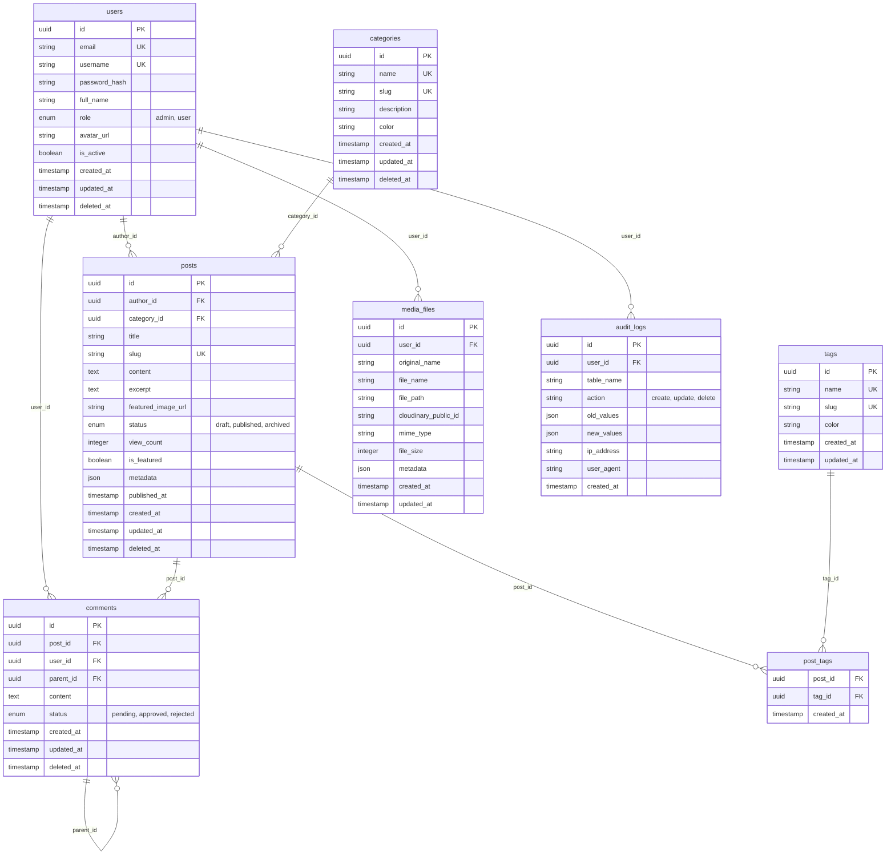

# Blog Management RESTful API - Architecture & Development Plan

## Project Overview

A comprehensive RESTful API for blog management built with Go, featuring authentication, role-based access control, media management, and external API integration.

## Tech Stack

- **Backend Framework**: Go with Gin Web Framework
- **Database**: PostgreSQL with GORM ORM
- **Caching**: Redis
- **External API**: Cloudinary for image/media management
- **Authentication**: JWT tokens
- **Migration**: GORM Auto-Migration
- **Configuration**: Viper for configuration management

## Database Schema Design

### Entity Relationship Diagram



### Database Tables Description

#### Users Table

- **Primary Key**: UUID for better security and scalability
- **Authentication**: Email/username with hashed passwords
- **Roles**: Simple two-tier system (admin, user)
- **Soft Delete**: Support for user deactivation

#### Posts Table

- **Content Management**: Title, slug, content, excerpt
- **Status Management**: Draft, published, archived states
- **SEO Features**: Metadata JSON field for SEO data
- **Analytics**: View count tracking
- **Media Integration**: Featured image URL from Cloudinary

#### Comments Table

- **Hierarchical Structure**: Parent-child relationship for nested comments
- **Moderation**: Status field for comment approval workflow
- **User Association**: Links to authenticated users

#### Categories & Tags

- **SEO Friendly**: Slug fields for URL-friendly identifiers
- **Visual Organization**: Color coding for UI enhancement
- **Many-to-Many**: Posts can have multiple tags via junction table

#### Media Files Table

- **Cloud Integration**: Cloudinary public ID for external storage
- **Metadata Storage**: JSON field for image dimensions, alt text, etc.
- **File Management**: Original and processed file information

#### Audit Logs Table

- **Complete Tracking**: Before/after values for all changes
- **User Context**: IP address and user agent for security
- **Action Types**: Create, update, delete operations

## Project Structure

```
blog-management/
├── cmd/
│   └── server/
│       └── main.go                 # Application entry point
├── internal/
│   ├── handlers/                   # HTTP request handlers
│   │   ├── auth_handler.go
│   │   ├── post_handler.go
│   │   ├── user_handler.go
│   │   ├── category_handler.go
│   │   ├── comment_handler.go
│   │   ├── media_handler.go
│   │   └── admin_handler.go
│   ├── services/                   # Business logic layer
│   │   ├── auth_service.go
│   │   ├── post_service.go
│   │   ├── user_service.go
│   │   ├── category_service.go
│   │   ├── comment_service.go
│   │   ├── media_service.go
│   │   └── audit_service.go
│   ├── repositories/               # Data access layer
│   │   ├── user_repository.go
│   │   ├── post_repository.go
│   │   ├── category_repository.go
│   │   ├── comment_repository.go
│   │   ├── tag_repository.go
│   │   ├── media_repository.go
│   │   └── audit_repository.go
│   ├── models/                     # Database models
│   │   ├── user.go
│   │   ├── post.go
│   │   ├── category.go
│   │   ├── comment.go
│   │   ├── tag.go
│   │   ├── media.go
│   │   └── audit.go
│   ├── middleware/                 # HTTP middleware
│   │   ├── auth.go
│   │   ├── cors.go
│   │   ├── logger.go
│   │   ├── rate_limit.go
│   │   └── audit.go
│   ├── utils/                      # Utility functions
│   │   ├── hash.go
│   │   ├── jwt.go
│   │   ├── slug.go
│   │   └── validator.go
│   ├── database/                   # Database configuration
│   │   ├── connection.go
│   │   └── migration.go
│   ├── cache/                      # Redis cache layer
│   │   ├── redis.go
│   │   └── cache_service.go
│   └── external/                   # External API integrations
│       └── cloudinary.go
├── pkg/                           # Public packages
│   ├── logger/                    # Structured logging
│   │   └── logger.go
│   ├── validator/                 # Input validation
│   │   └── validator.go
│   └── response/                  # Standardized API responses
│       └── response.go
├── configs/                       # Configuration files
│   ├── config.yaml
│   └── config.go
├── migrations/                    # Database migration files
├── docs/                         # API documentation
│   └── swagger.yaml
├── scripts/                      # Deployment and utility scripts
│   ├── setup.sh
│   └── migrate.sh
├── .env.example                  # Environment variables template
├── .gitignore
├── go.mod
├── go.sum
├── Dockerfile
├── docker-compose.yml
└── README.md
```

## API Endpoints Design

### Authentication Routes

```
POST   /api/v1/auth/register      # User registration
POST   /api/v1/auth/login         # User login
POST   /api/v1/auth/refresh       # Refresh JWT token
POST   /api/v1/auth/logout        # User logout
POST   /api/v1/auth/forgot        # Password reset request
POST   /api/v1/auth/reset         # Password reset confirmation
```

### User Management Routes

```
GET    /api/v1/users/profile      # Get current user profile
PUT    /api/v1/users/profile      # Update user profile
PUT    /api/v1/users/password     # Change password
PUT    /api/v1/users/avatar       # Update avatar
```

### Blog Post Routes

```
GET    /api/v1/posts              # List posts (with pagination, filters)
GET    /api/v1/posts/:id          # Get single post
POST   /api/v1/posts              # Create new post (Auth required)
PUT    /api/v1/posts/:id          # Update post (Auth + ownership)
DELETE /api/v1/posts/:id          # Delete post (Auth + ownership)
GET    /api/v1/posts/:id/comments # Get post comments
POST   /api/v1/posts/:id/comments # Add comment (Auth required)
PUT    /api/v1/posts/:id/publish  # Publish post (Auth required)
```

### Category Management Routes

```
GET    /api/v1/categories         # List all categories
GET    /api/v1/categories/:id     # Get single category
POST   /api/v1/categories         # Create category (Admin only)
PUT    /api/v1/categories/:id     # Update category (Admin only)
DELETE /api/v1/categories/:id     # Delete category (Admin only)
```

### Tag Management Routes

```
GET    /api/v1/tags               # List all tags
GET    /api/v1/tags/:id           # Get single tag
POST   /api/v1/tags               # Create tag (Auth required)
PUT    /api/v1/tags/:id           # Update tag (Admin only)
DELETE /api/v1/tags/:id           # Delete tag (Admin only)
```

### Media Management Routes

```
POST   /api/v1/media/upload       # Upload media file (Auth required)
GET    /api/v1/media              # List user's media files
GET    /api/v1/media/:id          # Get media file details
DELETE /api/v1/media/:id          # Delete media file (Auth + ownership)
```

### Comment Management Routes

```
GET    /api/v1/comments/:id       # Get single comment
PUT    /api/v1/comments/:id       # Update comment (Auth + ownership)
DELETE /api/v1/comments/:id       # Delete comment (Auth + ownership)
```

### Admin Routes

```
GET    /api/v1/admin/users        # List all users (Admin only)
PUT    /api/v1/admin/users/:id/status    # Update user status (Admin only)
GET    /api/v1/admin/posts        # List all posts (Admin only)
PUT    /api/v1/admin/posts/:id/status    # Update post status (Admin only)
GET    /api/v1/admin/comments     # List all comments (Admin only)
PUT    /api/v1/admin/comments/:id/status # Moderate comments (Admin only)
GET    /api/v1/admin/audit-logs   # View audit logs (Admin only)
GET    /api/v1/admin/stats        # System statistics (Admin only)
```

## Development Phases

### Phase 1: Project Setup & Foundation (Week 1)

**Objectives**: Establish project structure and basic infrastructure

**Tasks**:

1. **Project Initialization**

   - Initialize Go module: `go mod init blog-management`
   - Create directory structure as outlined above
   - Setup `.gitignore` and basic documentation

2. **Configuration Management**

   - Install Viper: `go get github.com/spf13/viper`
   - Create `config.yaml` and `config.go`
   - Environment variable handling
   - Configuration validation

3. **Database Setup**

   - Install GORM and PostgreSQL driver
   - Database connection configuration
   - Connection pooling setup
   - Health check endpoint

4. **Redis Setup**

   - Install Redis client: `go get github.com/go-redis/redis/v8`
   - Redis connection configuration
   - Basic cache service implementation

5. **Basic Middleware**
   - CORS middleware
   - Request logging middleware
   - Recovery middleware
   - Request ID middleware

**Deliverables**:

- Working project structure
- Database and Redis connections
- Basic HTTP server with middleware
- Configuration management system

### Phase 2: Authentication & Authorization (Week 2)

**Objectives**: Implement secure user authentication and role-based access control

**Tasks**:

1. **User Model & Migration**

   - Create User model with GORM tags
   - Implement soft delete
   - Create database migration
   - Add indexes for performance

2. **Password Security**

   - Implement bcrypt password hashing
   - Password strength validation
   - Secure password reset mechanism

3. **JWT Implementation**

   - JWT token generation and validation
   - Access and refresh token strategy
   - Token blacklisting for logout
   - Token middleware for route protection

4. **Authentication Handlers**

   - User registration with validation
   - User login with rate limiting
   - Token refresh endpoint
   - Logout with token invalidation
   - Password reset flow

5. **Authorization Middleware**
   - Role-based access control
   - Route protection middleware
   - Permission checking utilities

**Deliverables**:

- Complete authentication system
- JWT-based authorization
- User registration and login
- Role-based access control
- Password security measures

### Phase 3: Core Blog Features (Week 3-4)

**Objectives**: Implement core blog functionality with proper relationships

**Tasks**:

1. **Database Models**

   - Category model with slug generation
   - Post model with rich content support
   - Comment model with hierarchical structure
   - Tag model and many-to-many relationships
   - Proper foreign key constraints

2. **Repository Layer**

   - Generic repository interface
   - CRUD operations for all entities
   - Complex queries with joins
   - Pagination and filtering
   - Search functionality

3. **Service Layer**

   - Business logic implementation
   - Data validation and sanitization
   - Transaction management
   - Cache integration
   - Error handling

4. **HTTP Handlers**

   - RESTful endpoint implementation
   - Input validation
   - Response formatting
   - Error response handling
   - Pagination support

5. **Advanced Features**
   - Slug generation for SEO
   - Post status management
   - Comment moderation
   - View count tracking
   - Featured post functionality

**Deliverables**:

- Complete CRUD operations for all entities
- Proper database relationships
- Business logic implementation
- RESTful API endpoints
- Input validation and error handling

### Phase 4: External API Integration (Week 5)

**Objectives**: Integrate Cloudinary for media management

**Tasks**:

1. **Cloudinary Setup**

   - Install Cloudinary SDK: `go get github.com/cloudinary/cloudinary-go`
   - Configuration setup
   - Authentication with API keys
   - Upload configuration

2. **Media Model & Service**

   - Media file model
   - File upload validation
   - Image processing options
   - Metadata extraction
   - File organization

3. **Upload Handlers**

   - Single file upload endpoint
   - Multiple file upload support
   - File type validation
   - Size limit enforcement
   - Progress tracking

4. **Integration with Posts**

   - Featured image upload
   - Content image embedding
   - Image optimization
   - Responsive image delivery
   - Alt text management

5. **File Management**
   - File listing and search
   - File deletion (local and cloud)
   - File metadata updates
   - Usage tracking

**Deliverables**:

- Cloudinary integration
- File upload system
- Image optimization
- Media management endpoints
- Integration with blog posts

### Phase 5: Advanced Features & Optimization (Week 6)

**Objectives**: Implement caching, logging, audit trails, and performance optimization

**Tasks**:

1. **Redis Caching**

   - Cache frequently accessed data
   - Cache invalidation strategies
   - Session storage
   - Rate limiting with Redis
   - Cache warming

2. **Audit Trail System**

   - Audit log model
   - Automatic change tracking
   - User action logging
   - IP address and user agent tracking
   - Audit log querying

3. **Comprehensive Logging**

   - Structured logging with logrus/zap
   - Log levels and formatting
   - Request/response logging
   - Error logging and alerting
   - Log rotation and archival

4. **Error Handling**

   - Centralized error handling
   - Custom error types
   - Error response formatting
   - Error reporting and monitoring
   - Graceful degradation

5. **Performance Optimization**

   - Database query optimization
   - Index optimization
   - Connection pooling
   - Response compression
   - API rate limiting

6. **Queue System (Optional)**
   - Background job processing
   - Email notifications
   - Image processing queue
   - Cleanup tasks
   - Job monitoring

**Deliverables**:

- Redis caching implementation
- Comprehensive audit trail
- Structured logging system
- Centralized error handling
- Performance optimizations
- Optional queue system

### Phase 6: Testing, Documentation & Deployment (Week 7)

**Objectives**: Ensure code quality, documentation, and deployment readiness

**Tasks**:

1. **Testing**

   - Unit tests for services and repositories
   - Integration tests for handlers
   - Database testing with test containers
   - Mock implementations
   - Test coverage reporting

2. **API Documentation**

   - Swagger/OpenAPI specification
   - Interactive API documentation
   - Request/response examples
   - Authentication documentation
   - Error code documentation

3. **Security Hardening**

   - Input sanitization
   - SQL injection prevention
   - XSS protection
   - Rate limiting
   - Security headers

4. **Deployment Preparation**

   - Docker containerization
   - Docker Compose for development
   - Environment-specific configurations
   - Health check endpoints
   - Graceful shutdown

5. **Performance Testing**
   - Load testing
   - Stress testing
   - Memory profiling
   - Database performance analysis
   - Optimization recommendations

**Deliverables**:

- Comprehensive test suite
- API documentation
- Security hardening
- Docker deployment setup
- Performance testing results

## Key Implementation Details

### Authentication & Authorization

- **JWT Strategy**: Access tokens (15 minutes) + Refresh tokens (7 days)
- **Password Security**: bcrypt with cost factor 12
- **Role-Based Access**: Middleware checks user roles for protected routes
- **Rate Limiting**: Prevent brute force attacks on login endpoints

### Database Relations & Transactions

- **User → Posts**: One-to-Many relationship with cascade delete protection
- **Post → Comments**: One-to-Many with hierarchical threading
- **Post → Tags**: Many-to-Many through junction table
- **Transactional Operations**: Post creation with tags, media, and audit logging

### External API Integration

- **Cloudinary Features**:
  - Automatic image optimization
  - Multiple format support (WebP, AVIF)
  - Responsive image delivery
  - Secure upload with signed URLs
  - Transformation on-the-fly

### Caching Strategy

- **Post Caching**: Cache popular posts for 1 hour
- **Category Caching**: Cache category list for 24 hours
- **User Session**: Store session data in Redis
- **Rate Limiting**: Use Redis for distributed rate limiting

### Error Handling

- **Structured Errors**: Custom error types with codes
- **HTTP Status Codes**: Proper REST status code usage
- **Error Logging**: All errors logged with context
- **User-Friendly Messages**: Clean error responses for API consumers

## Configuration Example

```yaml
# config.yaml
server:
  port: 8080
  mode: development # development, production
  read_timeout: 30s
  write_timeout: 30s
  max_header_bytes: 1048576

database:
  host: localhost
  port: 5432
  user: postgres
  password: password
  dbname: blog_management
  sslmode: disable
  max_idle_conns: 10
  max_open_conns: 100
  conn_max_lifetime: 1h

redis:
  host: localhost
  port: 6379
  password: ""
  db: 0
  pool_size: 10
  min_idle_conns: 5

jwt:
  secret: your-super-secret-jwt-key-change-in-production
  access_token_expiry: 15m
  refresh_token_expiry: 168h # 7 days

cloudinary:
  cloud_name: your-cloud-name
  api_key: your-api-key
  api_secret: your-api-secret
  upload_folder: blog-management
  max_file_size: 10485760 # 10MB

logging:
  level: info # debug, info, warn, error
  format: json # json, text
  output: stdout # stdout, file

rate_limiting:
  requests_per_minute: 60
  burst: 10

pagination:
  default_page_size: 20
  max_page_size: 100
```

## Security Considerations

### Input Validation

- All user inputs validated using struct tags and custom validators
- SQL injection prevention through GORM parameterized queries
- XSS prevention through input sanitization
- File upload validation (type, size, content)

### Authentication Security

- Password hashing with bcrypt (cost factor 12)
- JWT tokens with short expiration times
- Refresh token rotation
- Rate limiting on authentication endpoints

### API Security

- CORS configuration for allowed origins
- Security headers (HSTS, CSP, X-Frame-Options)
- Request size limiting
- API versioning for backward compatibility

### Data Protection

- Soft delete for sensitive data
- Audit logging for all data changes
- Personal data encryption where required
- Secure file upload and storage

## Performance Optimization

### Database Optimization

- Proper indexing on frequently queried columns
- Connection pooling with optimal settings
- Query optimization and N+1 problem prevention
- Database query monitoring and slow query logging

### Caching Strategy

- Redis caching for frequently accessed data
- Cache invalidation on data updates
- Cache warming for critical data
- CDN integration for static assets

### API Performance

- Response compression (gzip)
- Pagination for large datasets
- Efficient JSON serialization
- Background processing for heavy operations

## Monitoring & Observability

### Logging

- Structured logging with correlation IDs
- Request/response logging
- Error logging with stack traces
- Performance metrics logging

### Metrics

- API response times
- Database query performance
- Cache hit/miss ratios
- Error rates and types

### Health Checks

- Database connectivity check
- Redis connectivity check
- External API availability check
- System resource monitoring

This comprehensive architecture provides a solid foundation for building a scalable, secure, and maintainable blog management API. The phased development approach ensures systematic implementation of all required features while maintaining code quality and best practices.
